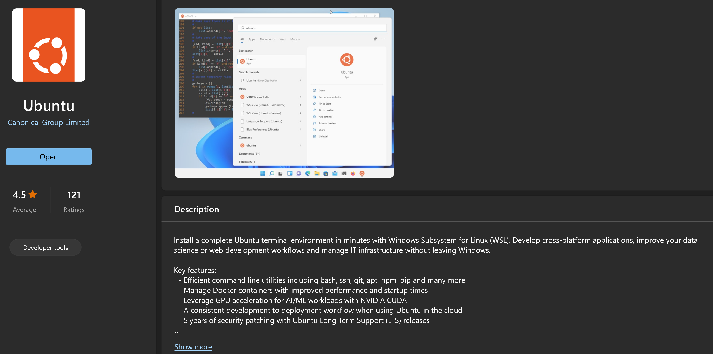

# Plataforma Web da Associação Iguais nas Diferenças

✨️Associação sem fins lucrativos que beneficia pessoas com deficiência 
através da equoterapia. 🐴🤍
📍Pato Branco-PR

---

## O que será necessário?
- Banco de Dados MySQL
- Python (versão <3)
- WSL ou VM Linux (Algumas bibliotecas são incompatíveis com o Windows)
- IDE de sua preferência (Recomendado PyCharm)

### Importante saber
O Sistema Operacional que você usará para desenvolver é irrelevante,
mas é importante que o projeto seja executado em Linux.

---

## Instalações
### Banco de Dados
1. Instalação local do MySQL 
    - Siga os passos [deste vídeo](https://www.youtube.com/watch?v=u96rVINbAUI) para instalar
    o MySQL Server e o MySQL Workbench.
    - Crie um novo Schema (Database) com o nome "iguaisnasdiferencas" conforme [este 
   vídeo](https://www.youtube.com/watch?v=x_ez4IlSGOE).
    - Para restaurar o backup (iguaisnasdiferencas.sql), siga os passos
   [deste vídeo](https://www.youtube.com/watch?v=x5Ko-NZVFPk).

2. Instalação via Docker
    - Siga os passos 
   [deste link](https://wanderingbisht.wordpress.com/2022/02/27/mysql-on-windows-using-docker-a-comprehensive-setup-using-docker-and-wsl/)
   para fazer a instalação completa do MySQL no Docker.
    - Para restaurar o backup (iguaisnasdiferencas.sql), siga os passos
   [deste vídeo](https://www.youtube.com/watch?v=x5Ko-NZVFPk).

### Python
- Na [página de download](https://www.python.org/downloads/)
do Python, baixe qualquer versão acima da 3.x e siga os passos no instalador.

### WSL ou VM Linux
1. WSL
   -  Siga os passos [deste link](https://learn.microsoft.com/pt-br/windows/wsl/install)
   para fazer a instalação do WSL.
   - Na loja da Microsoft, procure por Ubuntu e instale também.
   
   Ao fim da instalação, inicie o Ubuntu e siga os passos apresentados.
2. VM Linux
   - Siga os passos [deste vídeo](https://www.youtube.com/watch?v=XxZ8BTCBDis).

**Ao finalizar as instalações do Linux, execute o comando abaixo para instalar os
pacotes necessários no Linux** 
`sudo apt-get install pkg-config libcairo2-dev libsystemd-dev build-essential libdbus-glib-1-dev libgirepository1.0-dev -y`
   
~~Usa Ubuntu se quiser, mas te julgarei se não usar.~~

### IDE
1. PyCharm
   - Baixe [deste link](https://www.jetbrains.com/pycharm/download/)
   e siga os passos no instalador.
2. VSCode
   - ~~Usa se quiser, mas te julgarei rsrs🤮~~
   - Baixe [aqui](https://code.visualstudio.com/download)

---

## Banco de Dados

### Arquivo SQL com os dados do Banco de Dados MySQL
No arquivo `iguaisnasdiferencas.sql` você pode obter a estrutura de dados mais atualizada da aplicação. 
Para executar, você precisar ter o MySQL instalado no seu computador. 
Para restaurar a base basta executar o `.sql` em uma base de sua preferência.

---

## Python

### Criar ambiente virtual
`python3 -m venv venv`

### Para iniciar o ambiente
`source venv/bin/activate`

### Pacotes Necessários
`pip3 install -r requirements.txt`

### Para iniciar o servidor
`python3 manage.py runserver 0.0.0.0:5555`
